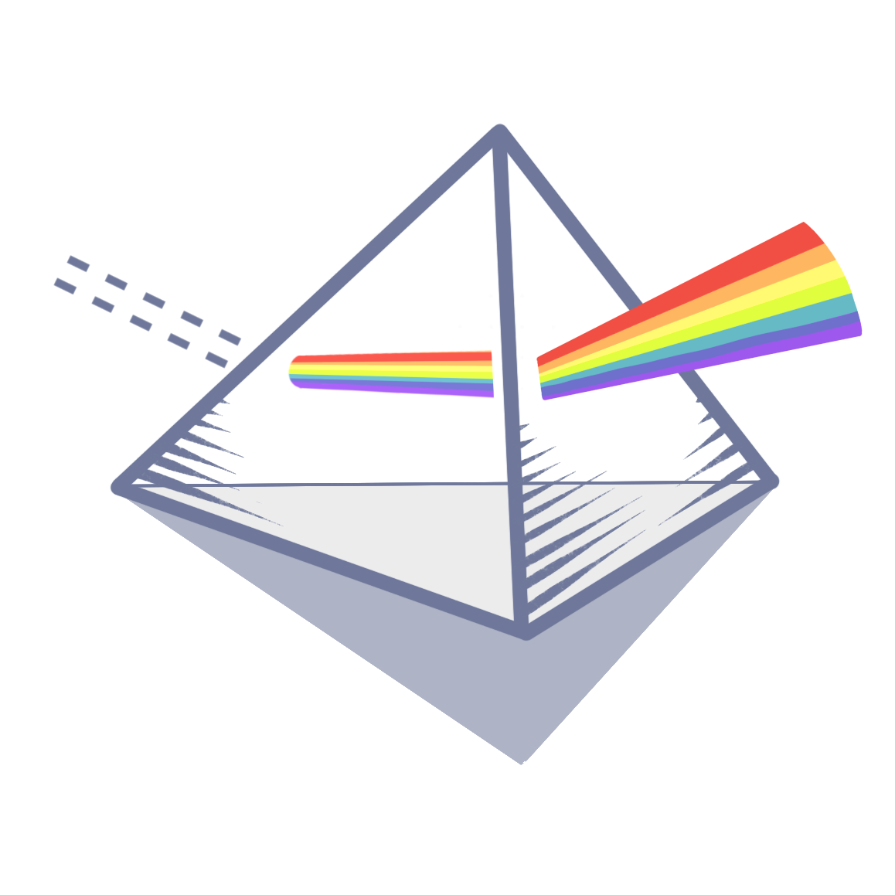
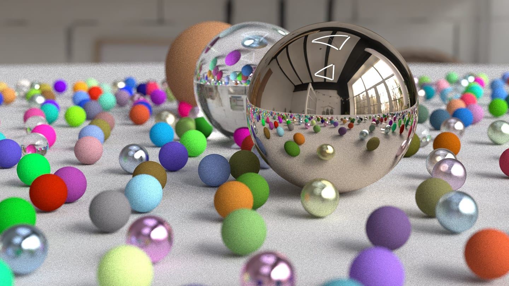
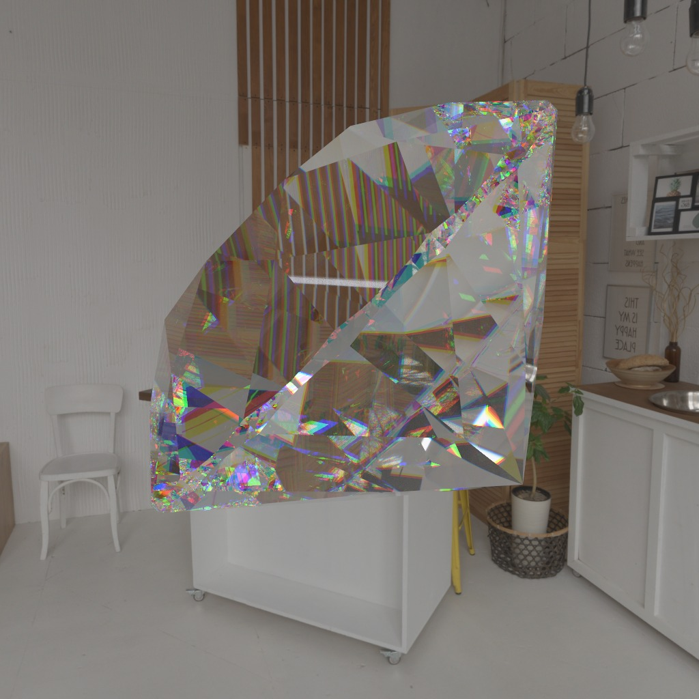
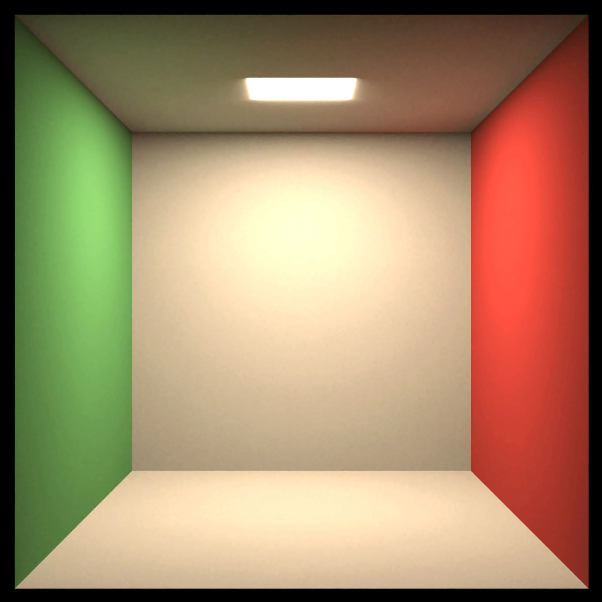
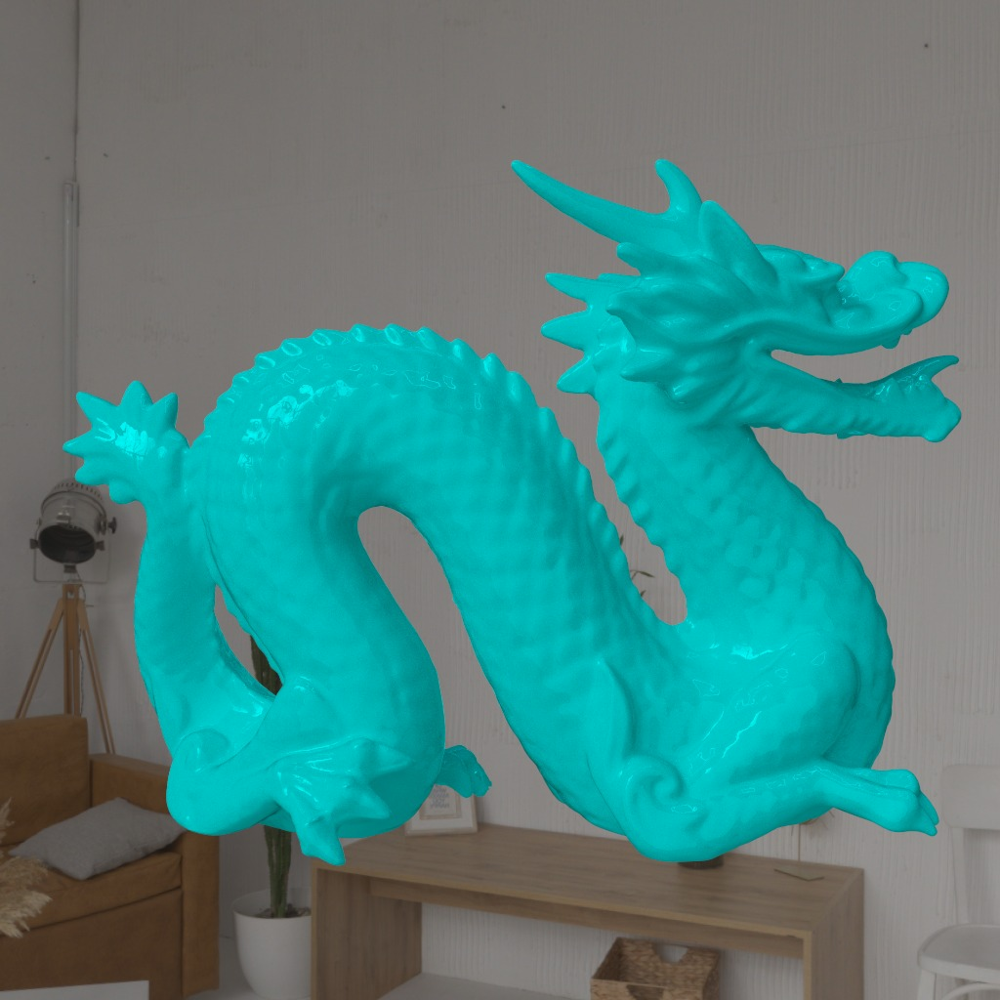

# Prisma
[](https://opensource.org/license/mit)

Prisma is a high-performance, cross-platform offline ray tracer designed for rendering photorealistic images. Built with the Rust WGPU framework for GPGPU acceleration, Prisma leverages advanced rendering techniques, including:

* microfacet-based BSDF models for physical material representation
* bounding volume hierarchy (BVH) with surface area heuristic (SAH) for efficient scene traversal
* multiple importance sampling (MIS) for improved sampling efficiency

The renderer also parses glTF files, enabling the generation of detailed and lifelike imagery directly from complex 3D scenes with PBR material attributes, without the need for manual intervention after export from 3D modeling software.


<p float="left">
    
    
    
</p>

## Features
* GPU-accelerated parallel computing powered by WGPU
* PBR materials with microfacet-based BSDF models
* BVH tree construction with SAH and optimized tree traversal
* Importance light sampling using MIS (Multiple Importance Sampling)
* HDRI environment mapping and automatic tone mapping
* Built-in glTF loader supporting multiple extensions
* Scene node hierarchy and object transformations

### glTF Extensions
* [KHR_materials_emissive_strength](https://github.com/KhronosGroup/glTF/blob/main/extensions/2.0/Khronos/KHR_materials_emissive_strength/README.md)
* [KHR_materials_ior](https://github.com/KhronosGroup/glTF/tree/main/extensions/2.0/Khronos/KHR_materials_ior)
* [KHR_materials_specular](https://github.com/KhronosGroup/glTF/tree/main/extensions/2.0/Khronos/KHR_materials_specular)
* [KHR_materials_transmission](https://github.com/KhronosGroup/glTF/tree/main/extensions/2.0/Khronos/KHR_materials_transmission)

## Usage
To get started with Prisma, simply clone the repository and run the program with a glTF scene file provided (remember to install a [Rust toolchain](https://rustup.rs/) first). Note that the program should be executed in release mode, otherwise it might take more than a minute to parse the scene.
```sh
git clone https://github.com/alanjian85/prisma.git && cd prisma
cargo run --release scenes/SciFiHelmet.glb
```

Prisma also provides a set of options to customize the rendering process, including:
* `-s, --size <SIZE>` \
  Set the image size of the output. The default is `400x225`.
* `-o, --output <OUTPUT>` \
  Specify the path for the rendered output image. The default path is `output.png`.
* `--depth <DEPTH>` \
  Control the maximum depth of each camera ray for ray tracing. The default value is `50`.
* `--samples <SAMPLES>` \
  Set the number of samples per pixel to control rendering quality. The default value is `1000`.
* `--hdri <HDRI>` \
  Specify the path to an HDRI environment map for realistic lighting in the scene, which is `textures/indoor.hdr` by default.
