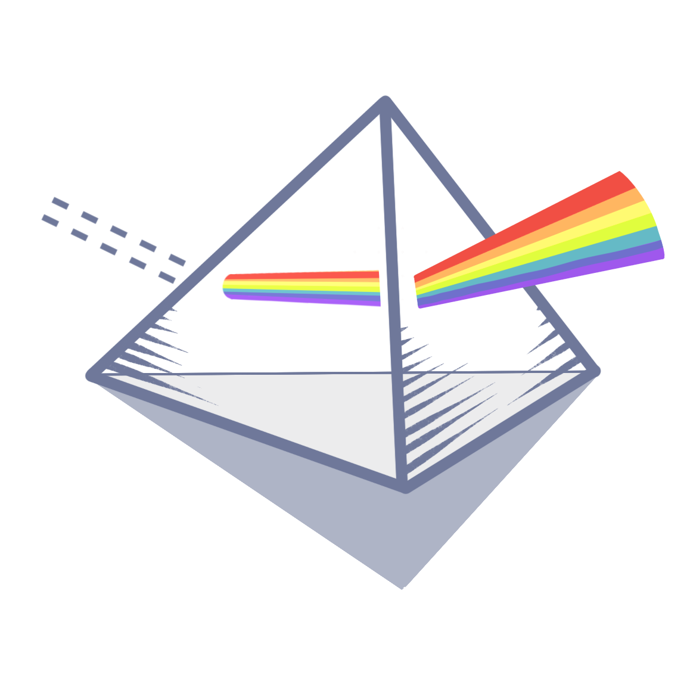
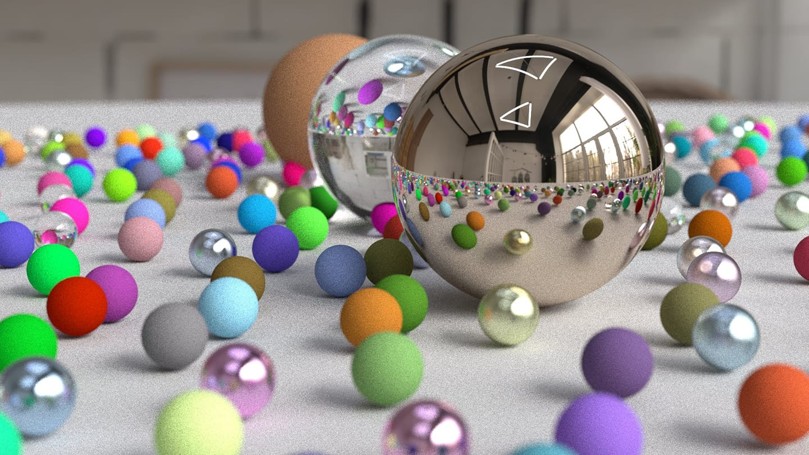
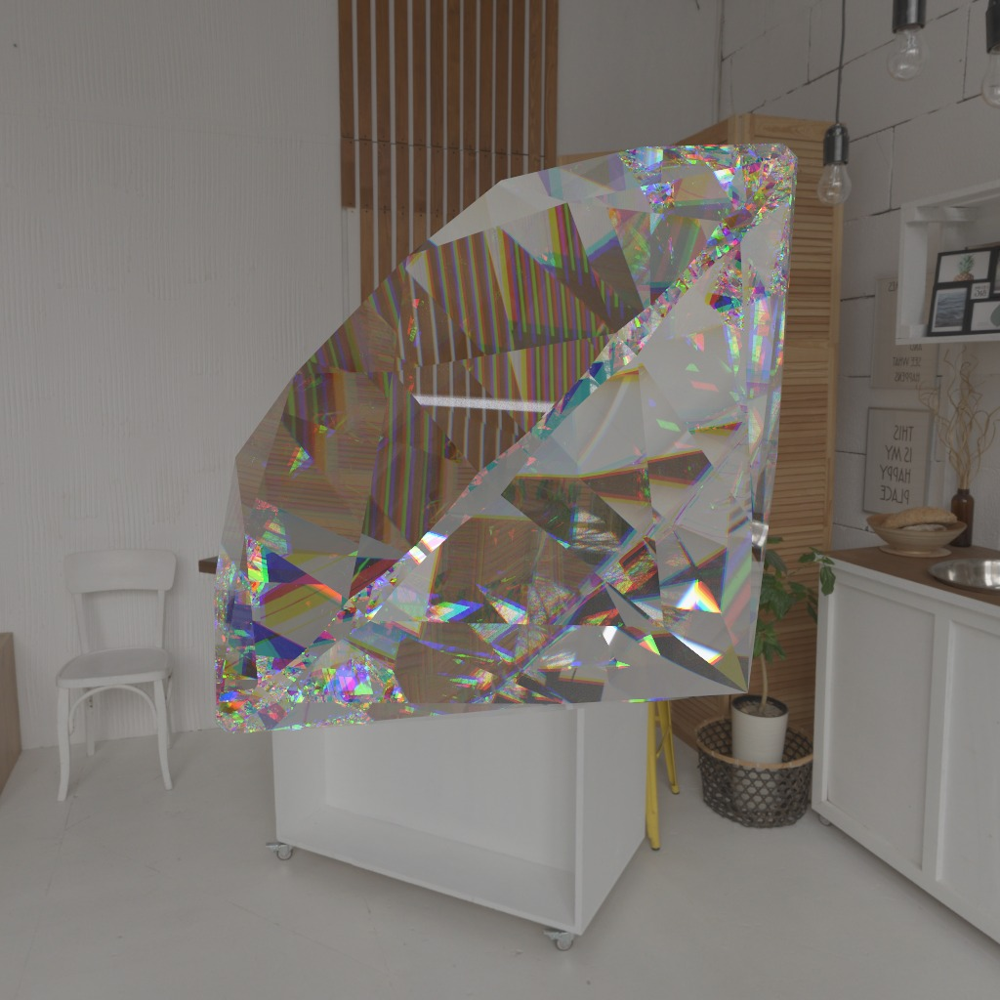
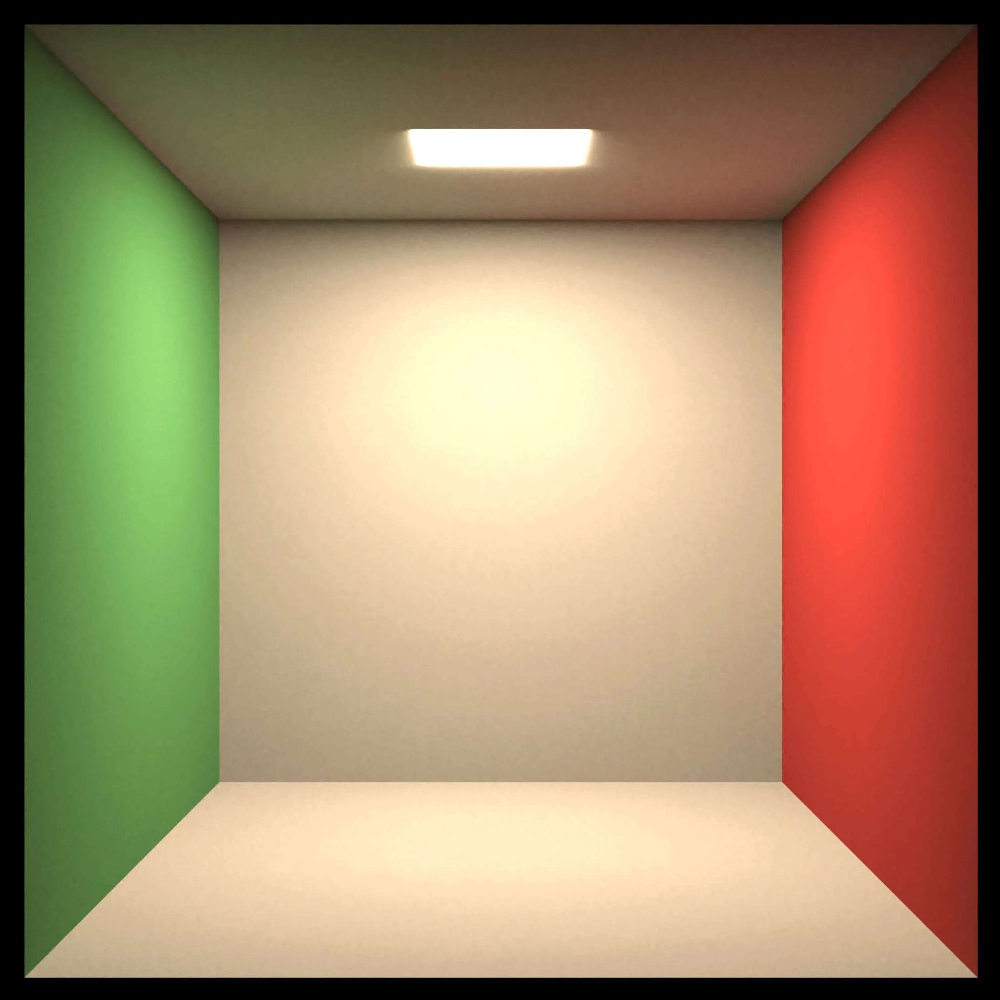
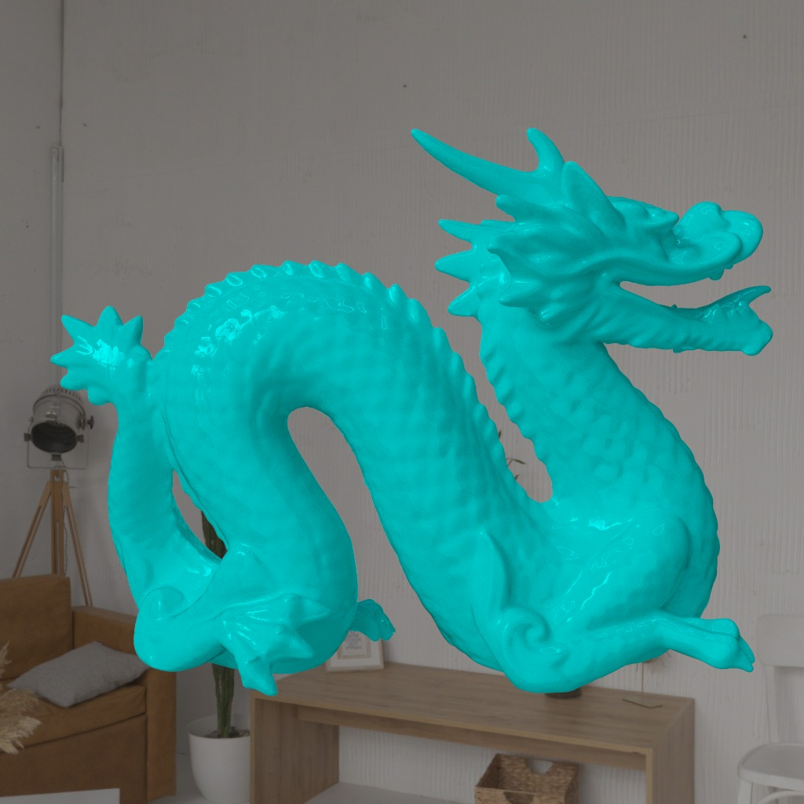

# Prisma

Prisma is a high-performance, cross-platform offline ray tracer designed for rendering photorealistic images. Built using the Rust WGPU framework for GPGPU acceleration, Prisma leverages advanced rendering techniques including microfacet-based BSDF models, bounding volume hierarchy (BVH) with surface area heuristic (SAH) for efficient scene traversal, and multiple importance sampling (MIS) for improved sampling efficiency. It processes glTF scene descriptions to produce realistic imagery, making it a powerful tool for rendering complex 3D scenes with high fidelity.

    
    
    

